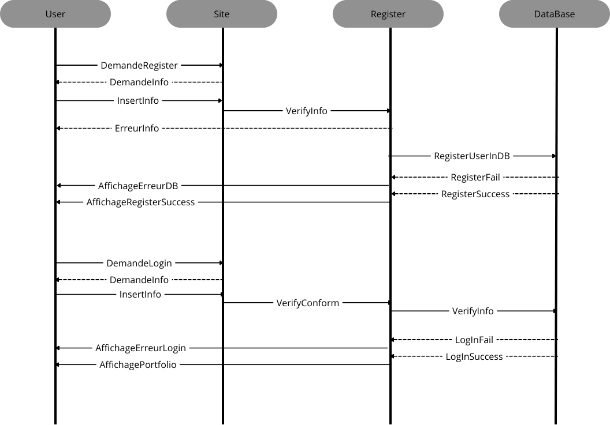

<!-- Fait moi le README du Projet -->

# Projet_Page_Connexion

This project is a web application for user authentication and login.

## Features

- User registration: Allows new users to create an account.
- User login: Allows registered users to log in to their account.
- Password reset: Provides a mechanism for users to reset their password if forgotten.
- Account management: Allows users to update their profile information and change their password.

## Installation

1. Clone the repository:

    ```bash
    git clone https://github.com/your-username/Projet_Page_Connexion.git
    ```

2. Navigate to the project directory:

    ```bash
    cd Projet_Page_Connexion
    ```

3. Install the dependencies:

    ```bash
    npm install
    ```

4. Start the application:

    ```bash
    npm start
    ```

## Usage

1. Open your web browser and navigate to `http://localhost:3000`.
2. Register a new account or log in with your existing credentials.
3. Explore the different features of the application.

## Contributing

Contributions are welcome! If you find any issues or have suggestions for improvement, please open an issue or submit a pull request.

## License

This project is licensed under the MIT License. See the [LICENSE](LICENSE) file for more information.

## Diagramme de sequence

